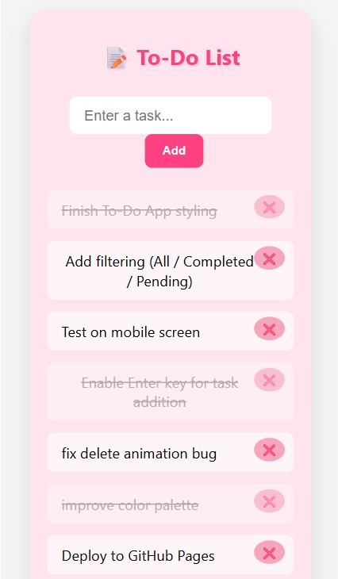
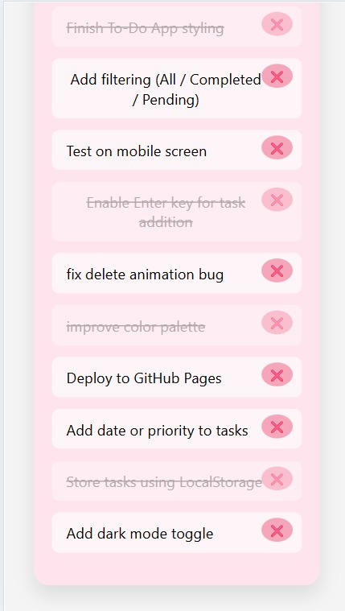

# 📋 To-Do List App

A simple, elegant and responsive To-Do List web app made using **HTML**, **CSS**, and **JavaScript**. Tasks are saved in the browser using **LocalStorage**, and the app includes smooth animations, mobile responsiveness, and useful features like filtering and keyboard shortcuts.

---

## 🚀 Features

- ✅ Add, delete, and mark tasks as completed  
- 🎯 Filter tasks by: All / Completed / Pending  
- ⌨️ Add tasks using the **Enter** key  
- 💾 Saves tasks in **LocalStorage**  
- 📱 Fully responsive mobile view  
- 🌙 Dark mode toggle (optional enhancement)  
- 🎨 Beautiful UI with animations  
- 🚫 Delete animation bug fixed  

---

## 📱 Screenshots

| Light Mode | Extended Task List |
|------------|--------------------|
|  |  |


## 🛠️ Technologies Used

- HTML5  
- CSS3  
- JavaScript (Vanilla JS)  
- LocalStorage for persistence

---

## 🌐 Live Demo

🔗 [View on GitHub Pages]( https://mokshita-b.github.io/todo-list-app/)


## 💡 How to Use

1. Clone the repo or download ZIP  
2. Open `index.html` in your browser  
3. Add tasks, mark them done, or delete them  
4. Refresh — your data stays saved!

---

## 📦 Installation

```bash
git clone https://github.com/Mokshita-B/todo-list-app.git
cd todo-list-app
```

Then open `index.html` directly in your browser.

---

## 🔄 Future Improvements

- [ ] Add dark mode toggle  
- [ ] Enable task editing  
- [ ] Drag-and-drop task reordering  
- [ ] Priority levels and due dates  
- [ ] Backend storage for sync across devices

---

## 🧑‍💻 Author

**Mokshitha**  
📧 [mokshtihabangarigari@gmail.com]  
🌐 [GitHub](https://github.com/Mokshita-B) 
